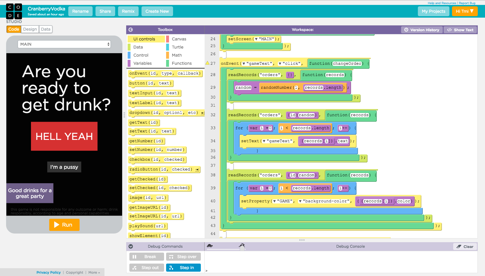
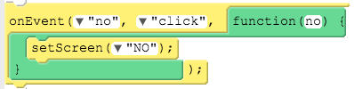
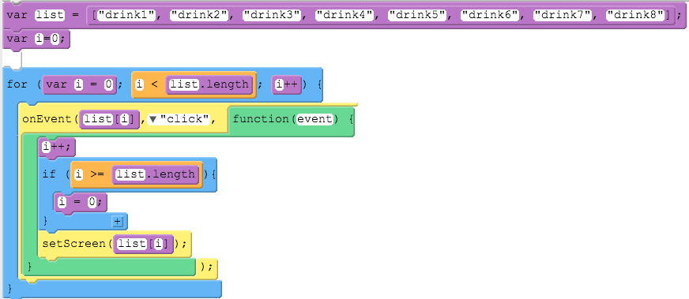
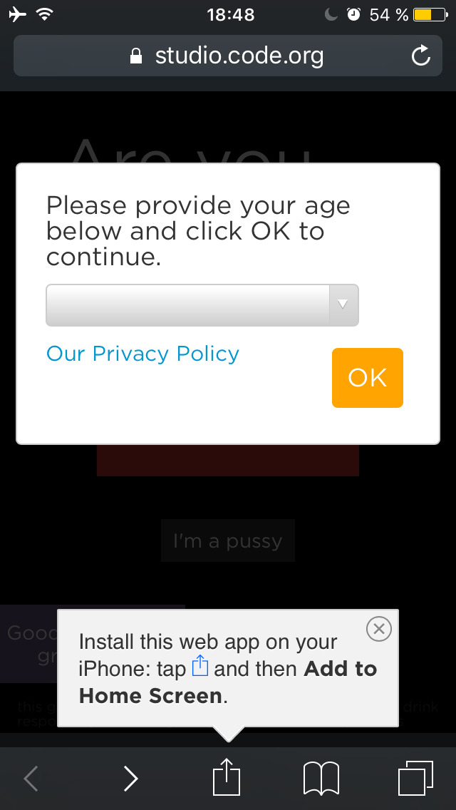
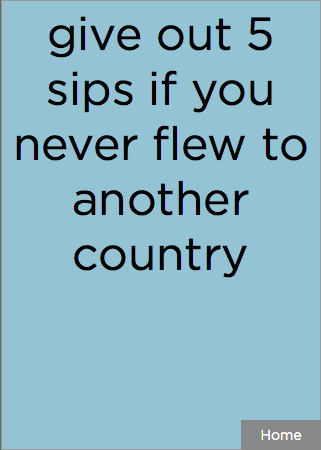
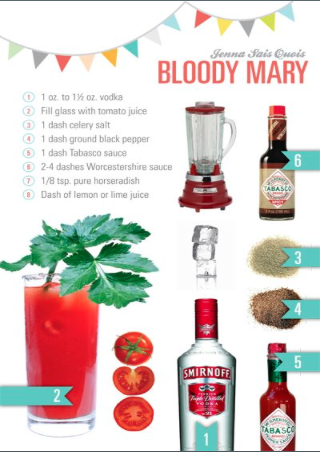
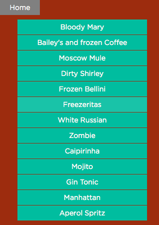

<h1>
<a id="Übe">CranberryVodka</a>
</h1>

<h3>Inhaltsverzeichnis</h3>
<ol>
<li><a href="#Cod">Code.org®</a></li>
<li><a href="#App">App-Konzept</a></li>
<li><a href="#Ver">Versionen</a></li>
<li><a href="#Pro">Programmierung</a></li>
<li><a href="#Fin">Finale App</a></li>
<li><a href="#Bug">Bugs</a></li>
</ol>

<h2>
<a id="Cod">Code.org®</a>
</h2>

Code.org® ist eine non-profitable Organisation, die es sich zur Ausgabe gemacht hat, jedem Schüler die Möglichkeit zu geben Informatik-Unterricht zu erhalten. Dies ist seit dem Start in 2013 durch Sponsoren wie Microsoft, Facebook, Google oder auch Einzelspendern ermöglicht worden.

Die benutzte Sprache ist JavaScript, welche zu Blöcken (aka: blocks) programmiert wurden, wodurch die angehenden Programmierer nicht viel Erfahrung mir JavaScrip haben müssen oder mit dem Programmieren an sich, da man weniger Fehler mit der Blockprogrammierung macht.

Es gibt verschiedene Kurse, sowie das Studio Applab, welches ich benutzt habe, um eine App zu erstellen.

Bei Applab gibt es 3 Bereiche in denen man arbeiten kann: Code, Design und Data.

Code wird zum Programmieren der App genutzt, während Design die screens erstellt und bei Data Listen erstellt werden können. Bei Code und Design ist das Smartphone erkennbar, damit die Programmierer erkennen, wie das Design sein könnte und welche Funktionen sie erstellen können.

<h2>
<a id="App">App-Konzept</a>
</h2>

Meine App wurde von der existierenden App <mark>"Picolo"</mark> inspiriert. Bei <mark>"Picolo"</mark> werden die Namen der jeweiligen Spieler eingefügt und personenbezogene Aufgaben werden erstellt.

Bei meiner App CranberryVodka gibt es <i>orders</i> und <i>drinks</i>. Die <i>orders</i> stehen für Befehle bzw. sind Texte, die den Spielern vorschreiben zu trinken/Schlücke zu verteilen, wenn bestimmte Bedingungen erfüllt wurden. Die <i>drinks</i> zeigen Rezepte zu beliebten, ausgewählten Cocktails, welche die Spieler machen können, um diese während des Spiels zu trinken.

<h2>
<a id="Ver">Versionen®</a>
</h2>

Abgesehen von dem späten Start des Projektes, gab es viele Hürden, die zu meistern waren. Es entstanden Probleme bei der Wiedergabe der orders und drinks, weswegen 2 verschiedene Ansätze beziehungsweise Versionen der App entstanden.

<h3>
Version 1
</h3>

Zuerst wurden screens mit den orders erstellt. Beim Klicken wird der User auf den nächsten screen geleitet, dies geschah in einer festgelegten Reihenfolge durch das manuelle Setzen der Bedingungen click, setscreen. Dadurch musste man, um eine neue order hinzuzufügen, einen neuen screen erstellen und manuell wieder ein event erstellen.

<h3>
Version 2
</h3>

Die screens wurden in einer Liste definiert, die abgelaufen wurde. Dadurch wurde die Liste in der festgelegten Reihenfolge abgelaufen und man musste einen neuen screen erstellen und diese in die Liste einfügen.

 
<h2>
<a id="Pro">Programmierung</a>
</h2>

Über den Entwurf wurden die 5 screens “MAIN”, “GAME”, “DRINKS”,”DRINKPIC” und “NO” grundlegend gestaltet. Alle Buttons und andere Objekte, die permanent vorhanden sind, wurden hier erstellt. Außerdem greift das Programm auf zwei vordefinierte und durch den Nutzer unveränderbare Datenbanken zu. Die erste heißt “orders” und beinhaltet drei Spalten “ID”, “text” und “color”, die zweite heißt “drinks” und beinhaltet ebenfalls drei Spalten “ID”, “url” und “name”.

Öffnet sich die App, so landet der Nutzer auf der Seite MAIN, die als Hauptseite (make default) definiert ist. Klickt er auf “I’m a pussy”, wird er einfach auf die Seite “NO” weitergeleitet, ein weiterer Klick auf diese Seite befördert ihn zurück auf die Startseite. Klickt der User auf “Hell Yeah”, so wird er auf den screen “GAME” weitergeleitet. Dort wird er von einem Einleitungstext im Textfeld “GameText” willkommen geheißen. Wenn dieses Textfeld, welches sich über den gesamten Bildschirm erstreckt, geklickt wird, startet die Funktion “changeOrder”. Sie soll auf die Datenbank orders zugreifen, daraus einen zufälligen Befehl greifen und den Text des Textfeldes “GameText” durch den Text eben dieses Befehls ersetzen. Außerdem soll die Funktion die Hintergrundfarbe der Seite zu einer zum Befehl gehörenden ändern.

Also wird zunächst mithilfe von readRecords eine zufällige Zahl zwischen 1 und der größten ID in der Datenbank “orders” auf die Variable “random” gespeichert. Daraufhin wird durch ein weiteres readRecords in der Datenbank nach der eben bestimmten zufälligen ID gesucht. Es folgt eine Ausgabe der entsprechenden Zeile, woraufhin diese Zeile in einer for-Schleifen durchlaufen wird und der Text des Textfeldes “gameText” durch den Wert in der Spalte “text” ersetzt wird. Dasselbe Procedere wird im Anschluss noch einmal durchlaufen, um mit dem Farbwert des Befehls die Hintergrundfarbe der Seite zu ändern. Wird erneut auf den gameText geklickt, so wiederholt sich schlichtweg die gesamte Funktion “changeOrder”, um den Befehl erneut zu ändern. Möchte der Nutzer wieder zurück zur Startseite, so muss er nur rechts unten auf den immer vorhandenen Button “Home” drücken.

Wird im Hauptmenü der Button “Good drinks for a great Party” ausgewählt, so wechselt die App auf die Seite “DRINKS”. In der Funktion “createButtons” werden mithilfe von readRecords hier in einer for-Schleife für jedes Listenelement in “drinks” Buttons erstellt, die jeweils ihre Beschriftung aus der Spalte “name” auslesen. Im Programm erhält man Bezeichungen, die von der jeweiligen ID abhängen, wie drink1, drink2, drink3 usw.. Außerdem werden die Buttons alle gleich formatiert und die y-Position auf dem Bildschirm anhand einer einfachen Formel, die von der ID Gebrauch macht, berechnet.

Wird nun einer der eben erstellten Buttons gedrückt, wird eine weitere Funktion readRecords gestartet, die mithilfe der ID des geklickten Buttons den Wert der Spalte url des zugehörigen Elementes findet. Nun wird auf die Seite “DRINKPIC” gewechselt, die Flächendeckend vom Bild recipe bedeckt ist. Dieses Bild erhält nun die eben gefundene url und das entsprechende Bild wird geladen. Wird dieses Bild wiederum geklickt, öffnet sich wieder der screen “DRINKS”, während die url des Bildes “recipe” genullt wird, sodass während der Ladezeit des nächsten Rezeptes nicht das alte Bild angezeigt wird.

Beim Klicken des Bildes wurde nicht nur die Seite gewechselt, sondern auch die Funktion “createButtons” neu gestartet, da diese nicht nur beim Klicken des Buttons “Good drinks for a great party”, sondern durch den Ausdruck “oder”, also “||” auch durch Drücken des Rezeptbildes gestartet wird. Um ein gedoppeltes Laden der Bilder zu vermeiden, werden hier zunächst alle alten Buttons gelöscht. Während des Aufenthalts auf dieser Seite ist es dem Nutzer ebenfalls möglich, jederzeit durch ein Drücken des Buttons “Home” auf den Startbildschirm zurück zu kehren.

<h2>
<a id="Fin">Finale App</a>
</h2>

Die fertige App kann nun über den Link <a href="https://studio.code.org/projects/applab/fE2MZErtLIvPFBxEBf-o7Q" target="_blank">CranberryVodka</a>  geteilt werden.

Wenn man den link öffnet, muss erst das Alter des Users angegeben werden. Applab verbietet es Minderjährigen die Apps auf dem Smartphone zu speichern und leitet diese zu Code.org® weiter.

Um die App auf das smartphone zu laden, muss man diese zu home screen hinzuzufügen.

  
<table border="0">
 <tr>
  <td width="50%">

  
 
 
 </td>
 <td width="50%">
 
 
 
 </td>
 </tr>
 
 <tr>
 <td>
 
 
 
 </td>
 <td>
 
 
 
 </td>
 </tr>
 </table>
 
<h2>
<a id="Bug">Bugs</a>
</h2>

Da der gametext mit der jeweiligen Hintergrundfarbe über den ganzen Bildschirm definiert wurde, mussten keine neuen screens geschaffen werden, wodurch das einfügen von neuen orders und drinks einfacher wird. Jedoch zieht das nach sich, dass ein dünner grauer Rand auf dem Bildschirm zu erkennen ist.

Dies könnte eventuell bei Design geändert werden(?)

Zudem können "random" wieder aus der liste orders gezogen werden, wodurch die gleiche order nochmals dran kommen kann.

Dies könnte eventuell geändert werden, indem die bereits gezogenen orders in eine neue Liste verschoben werden und nicht wieder gewählt werden können, jedoch ist die List fest definiert(?)

Die Liste könnte mehr orders erhalten und die Chancen, dass die selbe "random" gezogen wird, ist dadurch kleiner ?
Diese App wurde erstellt von Thao Mi Pham, 12 ab, im Rahmen des Informatikunterrichts an der Stormarnschule bei Herrn Buhl im Jahre 2016.

App is being used by Thao Mi Pham and her friends at parties :P

